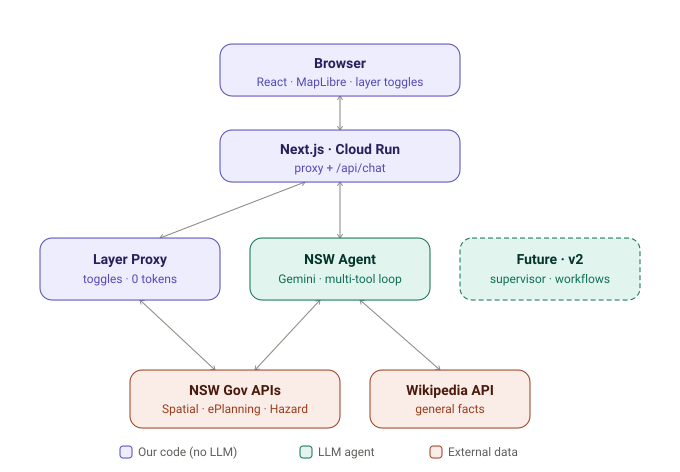

# NSW Place Analyser

Ask about any NSW property in plain English, or just click the map. One Gemini agent on Vertex AI answers — grounded in **live** NSW government data — and draws the relevant layers (parcels, zoning, bushfire, flood, suburbs) right on the map. No data stored; every query hits the source services live.



## What it does

- **Click any parcel** → it's selected, highlighted, and becomes the context for your next question (no need to re-type the address).
- **Ask in plain English** → "what's the zoning here?", "is this bushfire prone?", "could it flood?", "how big is this block?", "tell me everything about 10 Hunter St". The agent calls the right tools (in parallel where it can) and answers with cited facts.
- **Toggle data layers** → parcels · zoning · bushfire · flood · suburbs, drawn straight from the government services.
- **General knowledge** → out-of-scope questions (e.g. "biggest suburb in Queensland?") are answered via Wikipedia and clearly flagged as not NSW cadastre data.

## Design principle: token discipline

The map layer toggles and click-to-select are **deterministic API calls — zero LLM tokens**. The Gemini agent is used *only* for natural-language reasoning, and it never receives raw geometry (only attribute summaries), keeping cost-per-request tiny. Clicking is free; asking is cheap.

## Architecture

A single multi-tool agent for chat + a deterministic layer proxy for toggles. A supervisor / workflow-agent layer is drawn dashed — that's the **v2** roadmap, not built.

- **Frontend:** Next.js 15 (App Router) / React 19, MapLibre GL via `react-map-gl/maplibre`, OpenFreeMap basemap (no key).
- **Agent:** `@google/genai` in Vertex mode, native function calling, a multi-step loop that fans out parallel tool calls.
- **Data tools (live, anonymous):**
  - **Cadastre** (`portal.spatial.nsw.gov.au`) — parcels, address lookup, point-in-parcel.
  - **ePlanning** (`mapprod3.environment.nsw.gov.au`) — zoning, FSR, height, min lot size, heritage; Bush Fire Prone Land; Flood Planning Map.
  - **Wikipedia** — general knowledge.
- **Auth:** Application Default Credentials — **no key files anywhere**.

All services return Esri JSON; the app converts to GeoJSON with `@terraformer/arcgis` and draws it on the map.

## Run locally

```bash
npm install
cp .env.example .env          # set GOOGLE_CLOUD_PROJECT to your project id
gcloud auth application-default login
npm run dev                   # http://localhost:3000
npm test                      # unit tests (vitest)
```

One-time GCP setup:

```bash
gcloud config set project YOUR_PROJECT_ID
gcloud services enable aiplatform.googleapis.com run.googleapis.com cloudbuild.googleapis.com
```

## Deploy to Cloud Run

```bash
gcloud run deploy nsw-property-agent \
  --source . \
  --region australia-southeast1 \
  --allow-unauthenticated \
  --set-env-vars GOOGLE_GENAI_USE_VERTEXAI=true,GOOGLE_CLOUD_PROJECT=YOUR_PROJECT_ID,GOOGLE_CLOUD_LOCATION=australia-southeast1,GEMINI_MODEL=gemini-2.5-flash
```

## Try it

- `show me lot 1 in DP270928` → draws the parcel, cites `1//DP270928`
- click a parcel, then `is this bushfire prone?` → bushfire category + overlay
- `what's the zoning here?` → zone class (e.g. "Metropolitan Centre") + overlay
- `who owns it?` → honest "not available in public NSW data"
- `biggest suburb in Queensland?` → Wikipedia answer, flagged as general knowledge

## Limitations

- **No ownership or valuation** — not in open NSW data (Land Registry is paid).
- **Planning / hazard data is indicative, not legal advice.** Flood coverage depends on what each council has published to the Flood Planning Map.
- NSW only — clicks outside NSW are ignored; out-of-state facts come from Wikipedia, clearly flagged.

## Roadmap (v2)

- **Supervisor / multi-agent** orchestration (Google ADK) — ReAct, self-reflection, hierarchical delegation.
- **Workflow agents** — draft a pitch, build a shortlist, deep-research a suburb.
- **Observability** — tokens/sec, cost-per-request, tool-call tracing; an evaluation harness over the question taxonomy.
- Richer layers — schools / points of interest, elevation.

## Attribution

Cadastre data © State of New South Wales (Spatial Services). CC BY. Planning and hazard data © State of New South Wales (Department of Planning, Housing and Infrastructure).
